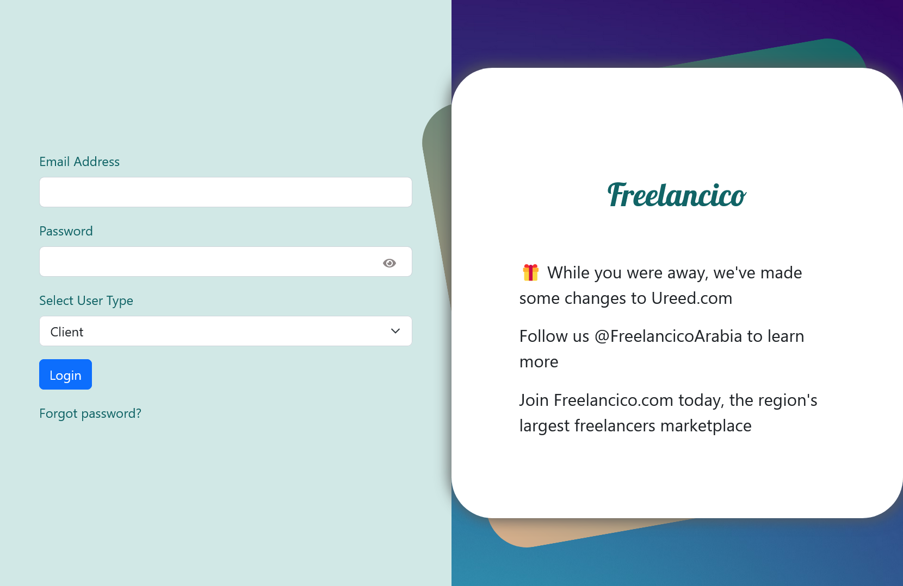

<!-- PROJECT LOGO -->
<br />
<div align="center">
  <a href="https://github.com/github_username/repo_name">
    
  </a>
<h3 align="center">Freelancing Platform</h3>
</div>


<!-- TABLE OF CONTENTS -->
<details>
  <summary style="color: Magenta; font-weight: bolder; font-size: 25px ">
    Table of Contents
  </summary>
  <ol>
    <li>
      <a href="#about-the-project">About The Project</a>
      <ul>
        <li><a href="#built-with">Built With</a></li>
      </ul>
    </li>
    <li>
      <a href="#getting-started">Getting Started</a>
      <ul>
        <li><a href="#prerequisites">Prerequisites</a></li>
        <li><a href="#installation">Installation</a></li>
      </ul>
    </li>
    <li><a href="#usage">Usage</a></li>
    <li><a href="#contributing">Contributing</a></li>
    <li><a href="#license">License</a></li>
    <li><a href="#contact">Contact</a></li>
    <li><a href="#authors">Authors</a></li>
    <li><a href="#acknowledgments">Acknowledgments</a></li>
  </ol>
</details>


<br /><br />

---

<br />


<!-- ABOUT THE PROJECT -->
## About The Project


**Devolenco** is a Freelancing Platform aims to produce an integrated Programming Services for both **Clients** and **Freelancers**, make it easier, and ensure to communicate and meet the requirements of the labor
market.

We target clients who need ***specialists in programming*** to develop and design
their own projects effectively and efficiently. And developers who want to use
their skills.

We offer ***Project-based*** unpaid ***Internships***, ***Hackathons***, and ***Courses*** for
freelancers and they are able to upload their certificates to our platform, in
addition to an assessment system to evaluate their capabilities with a progress
bar.

<br />

---

<br />

### Built With

* [![React][React.js]][React-url]
* [![Bootstrap][Bootstrap.com]][Bootstrap-url]
* [![Nodejs][nodejs.org]][Node-url]
* [![Express][Express.com]][Express-url]
* [![MongoDB][MongoDB.com]][MongoDB-url]

<!-- Title /  Logo Src / a href -->

<br />

---

<br />

<!-- GETTING STARTED -->
## Getting Started

To get start with the project you need to follow the instructions:

### Prerequisites


* You need to install The node package manger (NPM) & nodejs & MongoDB
  ```sh
  npm install npm@latest -g
  ```

### Installation

1. Clone the repo
   ```sh
   git clone https://github.com/RaniaElbaz/freelancePlatform/tree/master
   ```
2. Install NPM packages
   ```sh
   npm install
   ```
3. Start the Database Server
    ```sh
    mongod
   ```
4. Start the Backend Server
    ```sh
    npm start
   ```
5. Start the Frontend Server
    ```sh
    npm start
   ```

<br />

---

<br />


<!-- USAGE EXAMPLES -->
## Usage

To use the platform first you need to go to the home page, click signUp and Register to the website using your mail.. a verification link will sent to your mail, activate your mail and follow the instructions.. then login then you will directed to the find work pages.. navigate between the pages..

<div>
    
    <br />
    
</div>


<br />

---

<br />


<!-- CONTRIBUTING -->
## Contributing

Contributions are what make the open source community such an amazing place to learn, inspire, and create. Any contributions you make are **greatly appreciated**.

If you have a suggestion that would make this better, please fork the repo and create a pull request. You can also simply open an issue with the tag "enhancement".
Don't forget to give the project a star! Thanks again!

1. Fork the Project
2. Create your Feature Branch (`git checkout -b feature/AmazingFeature`)
3. Commit your Changes (`git commit -m 'Add some AmazingFeature'`)
4. Push to the Branch (`git push origin feature/AmazingFeature`)
5. Open a Pull Request


<br />

---

<br />

<!-- LICENSE -->
## License
Distributed under the MIT License. See `LICENSE.txt` for more information.


<!-- CONTACT -->
## Contact

Your Name - [@AhmedHamdy](https://twitter.com/AhmedHamdy) - Ahmed.H.Ameen1@gmail.com

Project Link: [https://github.com/github_username/repo_name](https://github.com/RaniaElbaz/freelancePlatform/tree/master)


<!-- Authors -->
## Authors:
  - Mohab Ezat
  - Rania El-Baz
  - Samaa Hamdy
  - Ahmed Hamdy


<br />

---

<br />


<!-- ACKNOWLEDGMENTS -->
## Acknowledgments

* This is a Graduation project for Full Stack Web Development (MEA\RN) track Supported by Information Technology Institute (ITI).

<!-- * []() -->


<!-- MARKDOWN LINKS & IMAGES -->

[React.js]: https://img.shields.io/badge/React-20232A?style=for-the-badge&logo=react&logoColor=61DAFB
[React-url]: https://reactjs.org/


[nodejs.org]: https://img.shields.io/badge/Node.js-35495E?style=for-the-badge&logo=nodejs&logoColor=4FC08D
[node-url]: https://nodejs.org/en/


[Bootstrap.com]: https://img.shields.io/badge/Bootstrap-563D7C?style=for-the-badge&logo=bootstrap&logoColor=white
[Bootstrap-url]: https://getbootstrap.com


[Express.com]: https://img.shields.io/badge/Express.js-35495E?style=for-the-badge&logo=express&logoColor=4FC08D
[Express-url]: https://expressjs.com/

[MongoDB.com]: https://img.shields.io/badge/MongoDB-35495E?style=for-the-badge&logo=mongodb&logoColor=4FC08D
[MongoDB-url]: https://www.mongodb.com/


